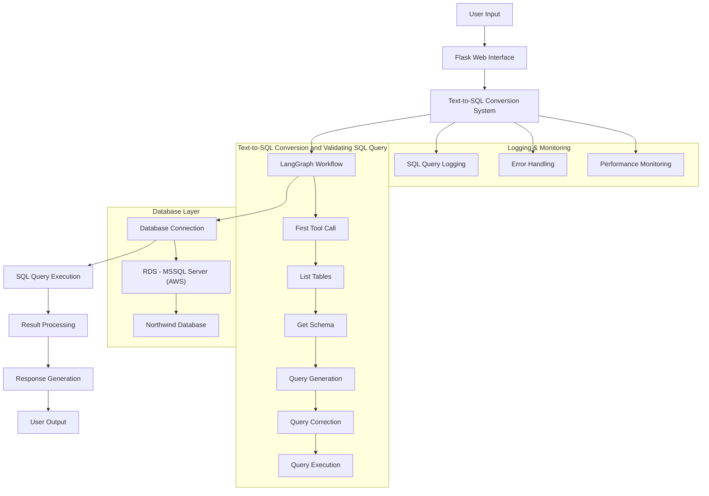

# Query-To-SQL

A sophisticated Natural Language to SQL query conversion system built with LangGraph, LangChain, and Flask. This project enables seamless conversion of natural language questions into SQL queries and their execution against a database, with robust error handling and performance optimization.

## System Architecture

The system follows a sophisticated architecture that combines natural language processing with database operations:

1. **User Interface Layer**: Flask-based web interface for natural language queries
2. **Processing Layer**: LangGraph and LangChain for query conversion and validation
3. **Database Layer**: AWS RDS MSSQL Server with Northwind database
4. **Monitoring Layer**: Comprehensive logging and performance tracking

### System Flow Diagram



## Core Workflow

1. **User Query Submission**
   - Natural language question submission through web interface
   - Input validation and security checks

2. **LangGraph Workflow Processing**
   - Table discovery and listing
   - Schema information retrieval
   - SQL query generation
   - Query validation and correction
   - Execution on MS SQL Server (AWS RDS)

3. **Result Processing**
   - Query result processing
   - Output formatting
   - Error handling

4. **Logging and Monitoring**
   - Interaction logging
   - Performance tracking
   - System monitoring

5. **Data Collection**
   - SQL query storage
   - Evaluation dataset creation
   - System fine-tuning support

## LangGraph State Machine

The system employs a sophisticated state machine to manage the query processing pipeline:

### Processing Nodes

1. **first_tool_call**
   - Initial tool setup
   - Table discovery initiation
   - State initialization

2. **list_tables_tool**
   - Database table listing
   - Schema fallback handling
   - Metadata management

3. **model_get_schema**
   - User intent analysis (GPT-4)
   - Schema identification
   - Table selection optimization

4. **get_schema_tool**
   - Schema data retrieval
   - Table relationship processing
   - Schema validation

5. **query_gen**
   - Initial SQL generation
   - Safety checks
   - Syntax validation

6. **correct_query**
   - SQL structure validation
   - Logical error correction
   - Safety assurance

7. **execute_query**
   - Query execution
   - Result processing
   - Fallback recovery

## Error Handling and Logging

### Error Management System

- **Tool Fallbacks**
  - Automatic retry mechanisms
  - Alternative processing paths
  - Graceful degradation

- **Query Validation**
  - SQL syntax verification
  - Injection prevention
  - Table/column validation
  - Structure analysis

- **Safe Execution**
  - Destructive operation prevention
  - Permission-based execution
  - Resource monitoring

- **Error Logging**
  - Detailed metadata
  - Stack trace recording
  - Performance impact tracking

## Performance Optimization

### Efficiency Features

- **Query Optimization**
  - Query plan analysis
  - Automatic refinement
  - Performance tuning

- **Resource Management**
  - Connection pooling
  - Resource cleanup
  - Thread management

- **Caching System**
  - Schema data caching
  - Intermediate result storage
  - Query result caching

- **Resource Handling**
  - Graceful connection closure
  - Log rotation
  - Memory management

## Project Structure

```
Query-To-SQL/
├── app.py                 # Flask application and API endpoints
├── config.py              # Configuration settings and database schema
├── Text_To_SQL_Langraph.py # Core query processing logic
├── sql_log.json           # Query execution logs
├── static/                # Static assets
├── templates/             # HTML templates
├── Evaluation/            # Evaluation scripts and metrics
├── Langgraph_Flow/        # LangGraph implementation
└── Langchain_Implementation/ # LangChain implementation
```

## Prerequisites

- Python 3.8+
- Flask
- LangGraph
- LangChain
- pymssql
- OpenAI API key
- LangSmith API key

## Installation

1. Clone the repository:
```bash
git clone https://github.com/parth0774/Query-To-SQL.git
cd Query-To-SQL
```

2. Install the required dependencies:
```bash
pip install -r requirements.txt
```

3. Set up environment variables:
```bash
export OPENAI_API_KEY="your_openai_api_key"
export LANGSMITH_API_KEY="your_langsmith_api_key"
export LANGSMITH_ENDPOINT="https://api.smith.langchain.com"
export LANGSMITH_PROJECT="Text-SQL-Agent"
```

## Database Configuration

The project is configured to work with a Northwind database. Update the database configuration in `config.py` with your credentials:

```python
DB_CONFIG = {
    'username': 'your_username',
    'password': 'your_password',
    'host': 'your_host',
    'database': 'your_database'
}
```

## Running the Application

1. Start the Flask application:
```bash
python app.py
```

2. Open your web browser and navigate to:
```
http://localhost:5000
```

## Usage

1. Enter your natural language question in the web interface
2. The system will convert it to SQL and execute the query
3. Results will be displayed along with the generated SQL query
4. Query history and logs are maintained for reference

## Database Schema

The system supports the following tables from the Northwind database:
- Categories
- Customers
- Order Details
- Orders
- Products

Detailed schema information is available in `config.py`.
