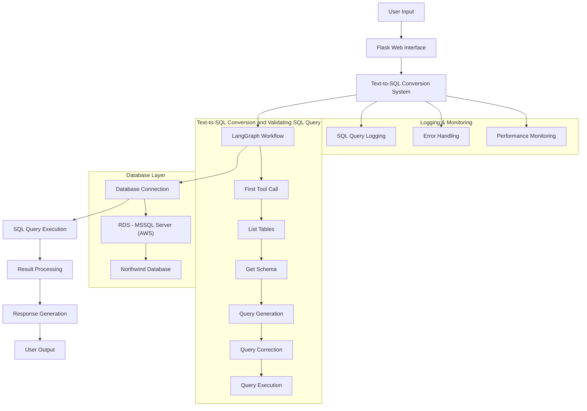

```mermaid
graph TD
    A[User Input] --> B[Flask Web Interface]
    B --> C[Text-to-SQL Conversion System]
    C --> D[LangGraph Workflow]
    D --> E[Database Connection]
    E --> F[SQL Query Execution]
    F --> G[Result Processing]
    G --> H[Response Generation]
    H --> I[User Output]

    subgraph "Text-to-SQL Conversion and Validating SQL Query"
        D --> D1[First Tool Call]
        D1 --> D2[List Tables]
        D2 --> D3[Get Schema]
        D3 --> D4[Query Generation]
        D4 --> D5[Query Correction]
        D5 --> D6[Query Execution]
    end

    subgraph "Database Layer"
        E --> E1["RDS - MSSQL Server (AWS)"]
        E1 --> E2[Northwind Database]
    end

    subgraph "Logging & Monitoring"
        L1[SQL Query Logging]
        L2[Error Handling]
        L3[Performance Monitoring]
    end

    C --> L1
    C --> L2
    C --> L3

```